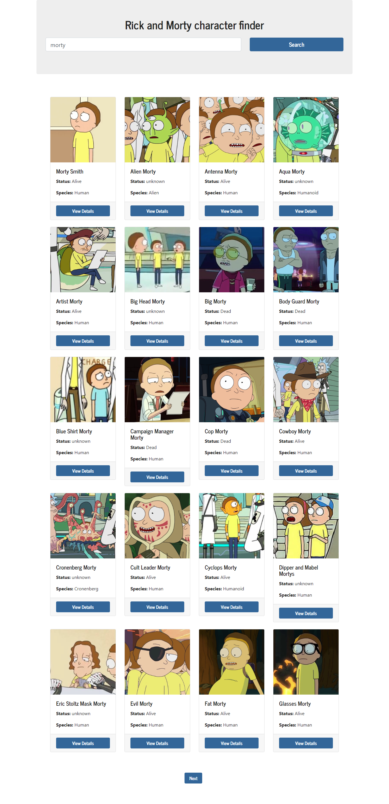

# Rick and Morty API

#   [DEMO](https://react-rickandmorty-node.netlify.app/)
## Home

## Start

## Info Character

# Rick and Morty Character Finder

This project is a Rick and Morty character finder that uses the Rick and Morty public API.

## Frontend

### Prerequisites
- Installed Node.js and npm

### Installation Instructions
1. Clone this repository: `git clone https://github.com/mssj-11/Rick_and_Morty.git`
2. Navigate to the frontend directory: `cd Rick_and_Morty/frontend`
3. Install dependencies: `npm install`

### Usage Instructions
1. Run the development server: `npm start`
2. Access the application at [http://localhost:3000](http://localhost:3000)
3. OR [NETLIFY](https://react-rickandmorty-node.netlify.app/)

## Backend

### Prerequisites
- Installed Node.js and npm

### Installation Instructions
1. Clone this repository: `git clone https://github.com/mssj-11/Rick_and_Morty.git`
2. Navigate to the backend directory: `cd Rick_and_Morty/backend`
3. Install dependencies: `npm install`

### Usage Instructions
1. Run the server: `npm start`
2. Access the API at [http://localhost:3001](http://localhost:3001)
2. Search Character in the API  [http://localhost:3001/api/search?characterName={NAME_CHARACTER}](http://localhost:3001/api/search?characterName=Rick)
2. Info Character for ID in the API  [http://localhost:3001/api/character/{ID_CHARACTER}](http://localhost:3001/api/character/2)

## Deployment

- The frontend is automatically deployed on Netlify.
- The backend can be deployed on the platform of your choice.
